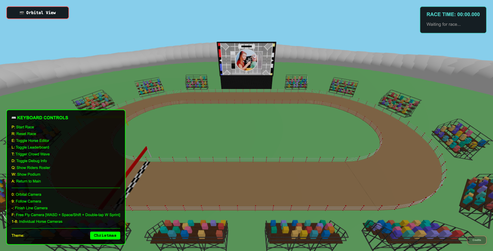

# SimHorse Racing

SimHorse Racing is a basic web-based horse racing simulator where small cubes, each representing a horse, race around a 3D track. The game features dynamic camera controls, a customizable horse editor, and interactive overlays for a fun and replayable experience.

## Overview

- **3D Horse Racing:** Watch simulated horses (cubes) compete on a configurable track.
- **Customizable Horses:** Use the built-in editor to import, export, and customize racers to apply funny hats.
- **Dynamic Cameras:** Multiple camera modes including orbital, follow, finish line, free fly, and individual horse views.
- **Interactive Overlays:** Leaderboard, riders roster, debug info, and podium scenes.
- **Crowd Animation:** Trigger a crowd wave for extra excitement.
- **Themes:** Switch between Normal and Christmas themes via the debug menu.

## Controls
| Key         | Action                                 |
|-------------|----------------------------------------|
| P           | Start Race                             |
| R           | Reset Race                             |
| E           | Toggle Horse Editor                    |
| L           | Toggle Leaderboard                     |
| T           | Trigger Crowd Wave                     |
| D           | Toggle Debug Info                      |
| Q           | Show Riders Roster                     |
| W           | Show Podium                            |
| A           | Return to Main                         |
| 0           | Orbital Camera                         |
| 9           | Follow Camera                          |
| -           | Finish Line Camera                     |
| F           | Free Fly Camera (WASD + Space/Shift, double-tap W to sprint) |
| 1-8         | Individual Horse Cameras               |

## Horse Editor
<video>
  <source src="/assets/horse-editor.mp4" type="video/mp4">
</video>

The horse editor which can be access via the "E" key, when shown the UI will allow you to alter the racers of the current race as well as change the seed of the race to alter the outcome. These options can be exported as a JSON file and imported if you want to replay these races at a later date.

## Development
Biome is also used as a formatter and linter.

1. **Install dependencies:**
   - Run `pnpm install` (or `npm install` if you use npm).
2. **Start the development server:**
   - Run `pnpm dev` or your project's start command.
3. **Open the app:**
   - Visit `http://localhost:5173` in your browser (see terminal for port).

## Footnote
I wanted to write a little footnote here why I felt it was necessary to mark the repo as "Made with AI" above. I feel it's important to disclose when AI has been the primary use of generation. This project was generated in combination with Claude and GPT 4.1 (When my Claude credits ran out). [Steam](https://store.steampowered.com/news/group/4145017/view/3862463747997849618) are doing something similar with their store.

Why do I feel this is important? For starters I don't want someone to look at this project and think:
- This is my coding style (I have many other repos to prove my good and bad code styles)
- Someone taking this project as a learning opportunity, this repo might contain some good code and whilst I have read a fair bit of this project I am not sure 100% what everything in this project does, I know the features of course but the code has been skim read. (There aren't even unit tests...)

The final question I guess is "Why didn't you write this" - I would like to think of myself as a competent developer and there will be developers that will look at this repo and form their own thoughts on the developer I am. But essentially I don't have ThreeJS skills and had this idea on a whim for a presentation happening 3 days later. Solutions creation and explaining features to non technical people is one of my strongest skills so using those skills to prompt an AI agent still ensured I had critical thinking, including debugging problems myself and telling the agent where it had gone wrong.

Finally that is why this repo has to also have a public license, I only own parts of the codebase I've refactored myself but the majority of it is AI and AI has no copyright as its not human!
